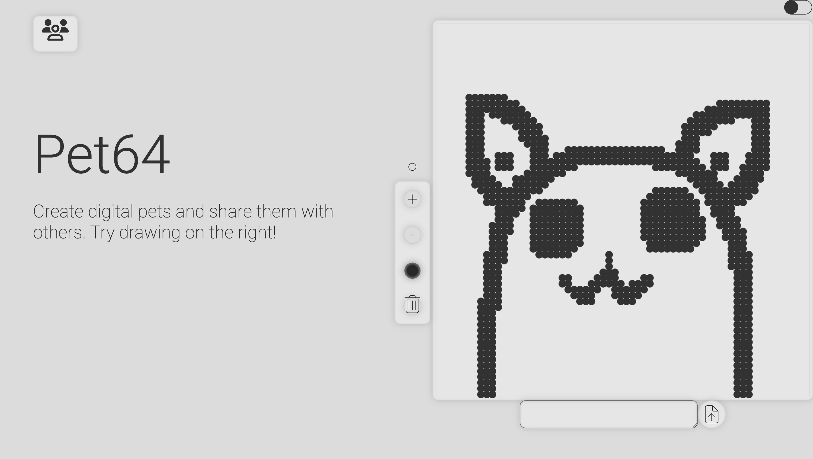
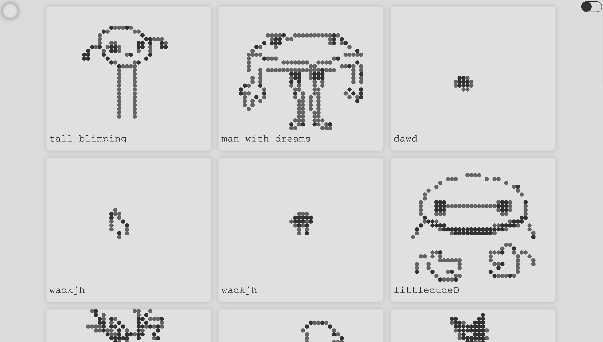
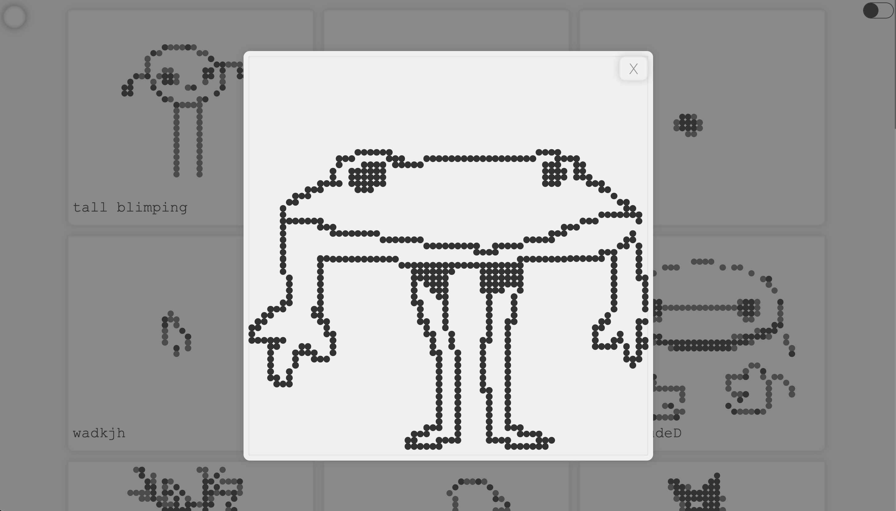

# Pet-64
A website to draw and share pets made of 64x64 dots.  
   
 

     
     
 

Its a full-stack web application hosted on CloudFlare and runs with Javascript to make API calls to an SQLlite database to fetch and store user's drawings. In a previous version the website supported account creation and handling but that has been since removed to lower the barrier to entry on creating Pet64 drawings.
